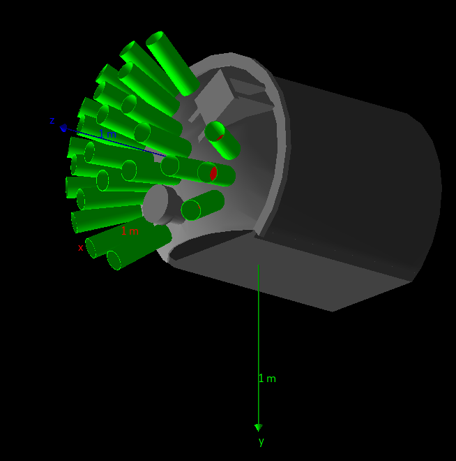
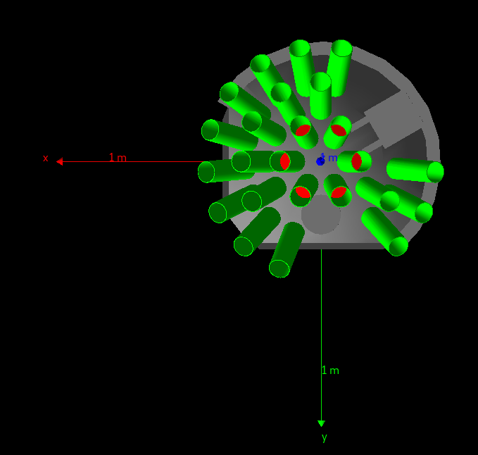
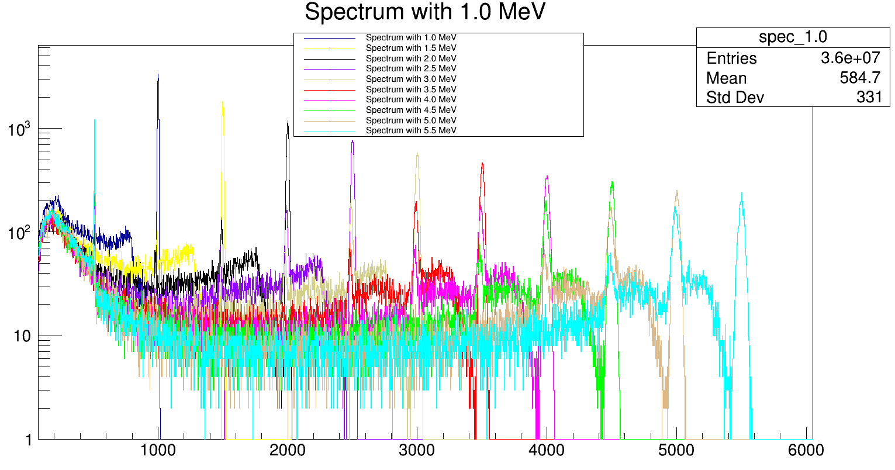

# Monte Carlo simulation of LaBr3 at magnex

Simulation of gamma ray detection emitted in the magnex magnetic spectrometer reaction chamber with an array of LaBr scintillators based on Geant4. 

Prerequisites: ROOT and Geant4

Run using ``run.sh`` in the build folder

Geometry of the simulation:

Example of detector response:

The simulation conveniently generates ROOT files to be analyzed